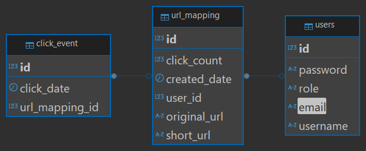

# MiniLinx
This project is a URL shortener service, similar to [bit.ly](https://bitly.com/)

**Link to project:** http://recruiters-love-seeing-live-demos.com/

## How It's Made:

**Tech used:** Spring Boot, MySQL, Hibernate, React, Tailwind 

I used a Springboot backend with Hibernate and MySQL as ORM and database respectively. Shortened URL was generated using  random keys which is then mapped to the correct longer original URL in the DB as such.

For frontend, I used React JS along with Tailwind CSS to ease along with Chart.js for dashboard analytics for the URLs.
<!-- ## Optimizations
*(optional)*

You don't have to include this section but interviewers *love* that you can not only deliver a final product that looks great but also functions efficiently. Did you write something then refactor it later and the result was 5x faster than the original implementation? Did you cache your assets? Things that you write in this section are **GREAT** to bring up in interviews and you can use this section as reference when studying for technical interviews! -->

## Lessons Learned:

Through this project I learnt a lot about how a URL shortner service works. I learnt about designing and planning for a fullstack web application, designing the database. I also learnt how to deploy and host a web application.

